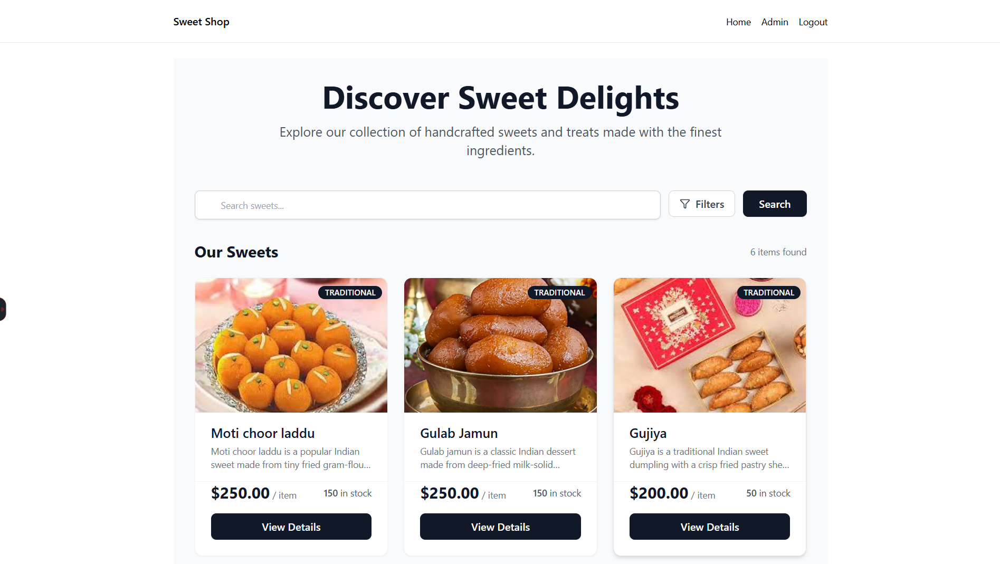
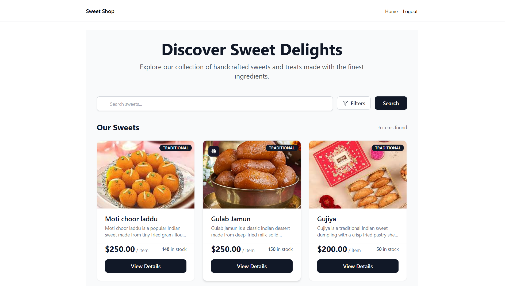
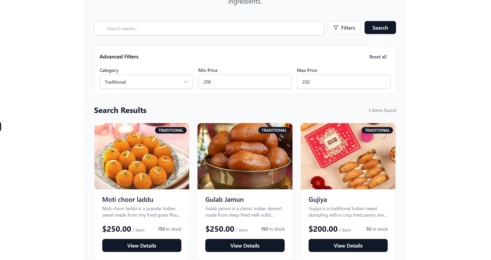
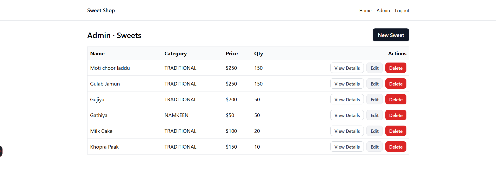
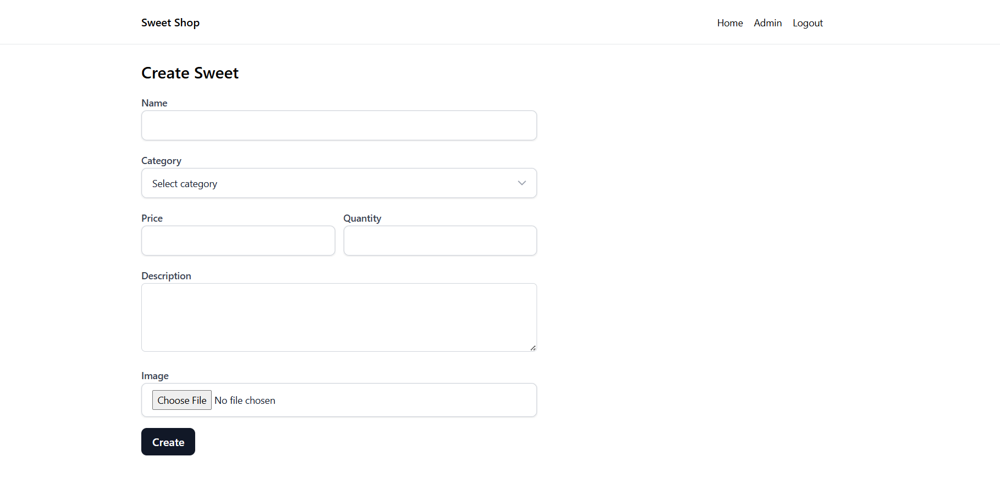
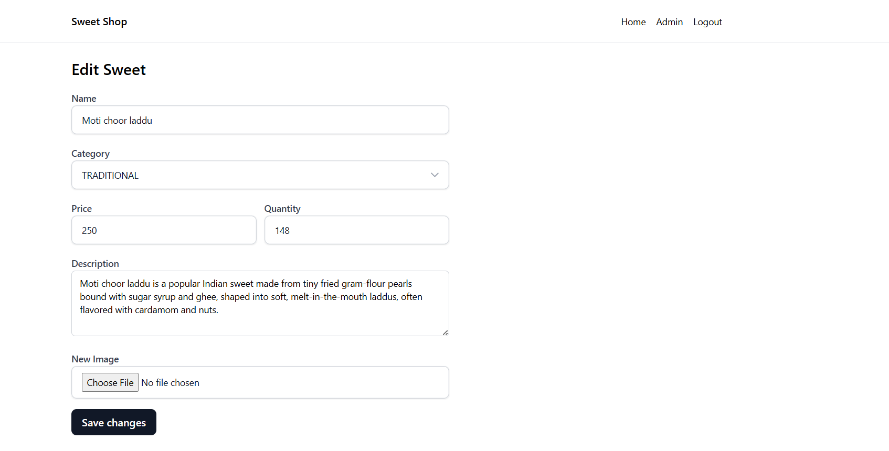

# Sweet Shop Management System – Backend (MERN)

## Project Overview

This project is a backend implementation of a **Sweet Shop Management System** built using **Node.js, Express, MongoDB, and Mongoose**.  
The system provides APIs for authentication, sweet inventory management, and stock handling using role-based access control.

The application is designed according to the given assessment requirements and intentionally avoids unnecessary overengineering.

---

## Tech Stack

- Node.js
- Express.js
- MongoDB
- Mongoose
- JWT (Authentication)
- bcryptjs (Password hashing)
- Cookie-based authentication
- RESTful API design

---

## Features Implemented

### Authentication
- User registration
- User login
- Logout
- Get authenticated user profile
- JWT stored in HttpOnly cookies
- Role-based authorization (USER / ADMIN)

### Sweet Management
- Create sweet (Admin only)
- Get all sweets
- Search sweets (name, category, price range)
- Update sweet (Admin only)
- Delete sweet (Admin only)

### Inventory Management
- Purchase sweet (reduces quantity)
- Restock sweet (Admin only)
- Atomic stock updates to prevent race conditions

---

## Data Models

### User Model
- name
- email
- password (hashed)
- role (USER / ADMIN)
- timestamps

### Sweet Model
- name
- category (enum)
- price
- quantity
- description
- timestamps

Only **two models** are used, as required by the assessment.

---

## API Endpoints

### Auth Routes
- POST `/api/auth/register`
- POST `/api/auth/login`
- POST `/api/auth/logout`
- GET `/api/auth/profile`

### Sweet Routes
- POST `/api/sweets` (Admin)
- GET `/api/sweets`
- GET `/api/sweets/search`
- PUT `/api/sweets/:id` (Admin)
- DELETE `/api/sweets/:id` (Admin)
- POST `/api/sweets/:id/purchase`
- POST `/api/sweets/:id/restock` (Admin)

---

## Security & Authorization

- JWT-based authentication
- Token stored in HttpOnly cookies
- Protected routes using `isAuthenticated` middleware
- Admin-only actions protected using `isAdmin` middleware
- No client-side trust for roles

---

## Inventory Logic (Important)

- Purchase uses **atomic MongoDB updates** to avoid race conditions
- Prevents purchase when stock is zero
- Restock only allows positive quantity increments

---

## How I Used AI (ChatGPT)

AI tools were used **as a coding assistant**.

### What I wrote myself
- User model
- Sweet model
- Authentication controller
- Route structure
- Middleware logic
- Overall backend architecture
- Validation decisions
- API design according to assessment
- And rewite this readme file

### Where AI helped
- After I shared my **controller writing style**, I asked for help writing:
  - Purchase and restock logic
- I explicitly requested the code to be written **in my existing format and style**
- AI helped by:
  - Matching my controller structure
  - Ensuring atomic database operations
  - Fixing edge cases and improving correctness
- I reviewed, understood, and integrated the code manually

### How AI was used overall
- As a **second brain** to validate logic
- To speed up implementation while maintaining consistency
- To avoid common mistakes (race conditions, improper route design)

All architectural decisions, final implementations, and integrations were done by me.

---

### Landing page for admin

### Landing page for user

### Sweet filter page

### Admin Dahsboard

### Sweet Details page

### Admin only add sweet page

### Admin only edit sweet page

